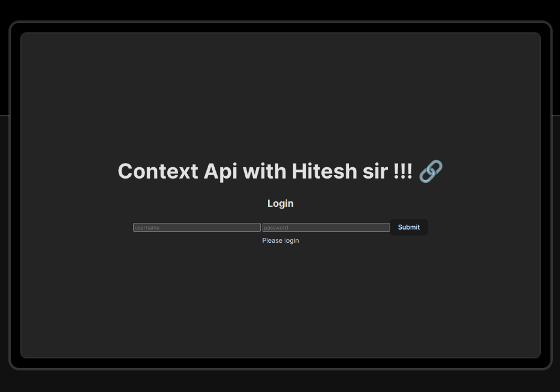

# React Context API Project Documentation

### Overview

> This React application utilizes the Context API for state management, demonstrating a simplified user authentication flow. The project includes a UserContextProvider managing user authentication state, a form submission handler for login, and components for displaying user information based on authentication status.

### Demo :

### You can Check it Live on Below Link :

[Live Link !](https://context-api-zeta.vercel.app/)

### Technologies Used 

1. React: A JavaScript library for building user interfaces.

2. Context API: A feature in React for managing state across components without prop drilling. In your project, the UserContextProvider uses the Context API to manage user authentication state.

3. Vercel: A cloud platform for static sites and serverless functions, used for deploying the React application. The live demo of the project is hosted on Vercel.

4. JavaScript/JSX: The primary programming language used for developing React applications.

5. HTML/CSS: Fundamental technologies for structuring the markup and styling the user interface.

6. npm: The package manager for JavaScript, used for installing and managing project dependencies.

7. Babel: A tool for converting modern JavaScript code into a backward-compatible version that can run in older browsers.

8. ESLint: A static code analysis tool for identifying and fixing problems in your JavaScript code.

9. Prettier: An opinionated code formatter for enforcing a consistent code style.